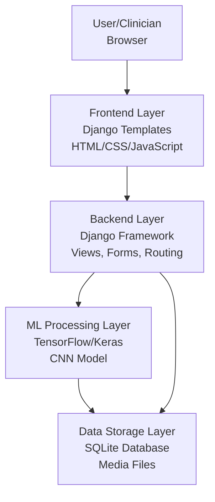
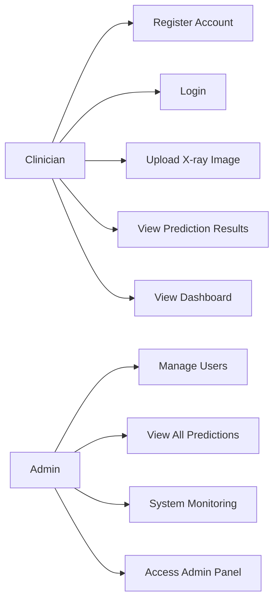
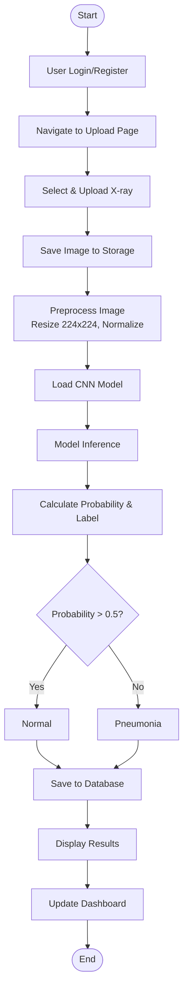

# Diagram Descriptions for Pneumonia Prediction Project

This document contains detailed descriptions for creating System Architecture, Use Case, and Workflow diagrams.

---

## 1. SYSTEM ARCHITECTURE DIAGRAM

### Layout (Top to Bottom):

```
┌─────────────────────────────────────────┐
│         USER/CLINICIAN                 │
│              (Browser)                  │
└─────────────────┬─────────────────────┘
                  │ HTTP Request
                  ▼
┌─────────────────────────────────────────┐
│         FRONTEND LAYER                  │
│  Django Templates (HTML/CSS/JavaScript) │
│  • Login/Signup Pages                    │
│  • Image Upload Interface                │
│  • Results Display                       │
│  • Dashboard View                        │
└─────────────────┬─────────────────────┘
                  │
                  ▼
┌─────────────────────────────────────────┐
│      BACKEND LAYER (Django Framework)   │
│  • Views (upload_and_predict, dashboard) │
│  • Forms (UploadImageForm)               │
│  • URL Routing                           │
│  • Authentication & Authorization        │
└─────────────────┬─────────────────────┘
                  │
                  ▼
┌─────────────────────────────────────────┐
│        ML PROCESSING LAYER               │
│  TensorFlow/Keras Model                  │
│  • Image Preprocessing                   │
│    (resize to 224x224, normalize)        │
│  • CNN Inference (pneumonia_model.h5)    │
│  • Prediction Probability Calculation    │
└─────────────────┬─────────────────────┘
                  │
                  ▼
┌─────────────────────────────────────────┐
│        DATA STORAGE LAYER                │
│  • SQLite Database (Predictions Table)   │
│  • Media Storage (Uploaded X-ray Images) │
└─────────────────────────────────────────┘
```

### Components:
- **User/Clinician**: Browser-based interface
- **Frontend Layer**: Django templates rendering HTML/CSS/JavaScript
- **Backend Layer**: Django views, forms, URL routing, authentication
- **ML Processing Layer**: TensorFlow/Keras model for image analysis
- **Data Storage Layer**: SQLite database and file system for media

### Data Flow:
1. User → Frontend: HTTP requests
2. Frontend → Backend: Form submissions
3. Backend → ML Layer: Image processing requests
4. ML Layer → Backend: Prediction results
5. Backend → Storage: Save predictions and images

---

## 2. USE CASE DIAGRAM

### Actors:
1. **Clinician** (Primary User)
2. **Admin** (System Administrator)

### Use Cases for Clinician:
- Register Account
- Login
- Upload X-ray Image
- View Prediction Results
- View Dashboard

### Use Cases for Admin:
- Manage Users
- View All Predictions
- System Monitoring
- Access Admin Panel

### Diagram Structure:
```
                    ┌─────────────────────────────────────┐
                    │   Pneumonia Prediction System      │
                    │                                     │
    ┌───────────┐   │   ┌──────────────────────────┐    │   ┌──────────┐
    │ Clinician │───┼──▶│  Register Account        │    │   │  Admin   │
    │           │   │   ├──────────────────────────┤    │   │          │
    │           │───┼──▶│  Login                    │    │   │          │
    │           │   │   ├──────────────────────────┤    │   │          │
    │           │───┼──▶│  Upload X-ray Image       │    │   │          │
    │           │   │   ├──────────────────────────┤    │   │          │
    │           │───┼──▶│  View Prediction Results │    │   │          │
    │           │   │   ├──────────────────────────┤    │   │          │
    │           │───┼──▶│  View Dashboard          │    │   │          │
    └───────────┘   │   └──────────────────────────┘    │   │          │
                    │                                     │   │          │
                    │   ┌──────────────────────────┐    │   │          │
                    │   │  Manage Users             │◀───┼───│          │
                    │   ├──────────────────────────┤    │   │          │
                    │   │  View All Predictions     │◀───┼───│          │
                    │   ├──────────────────────────┤    │   │          │
                    │   │  System Monitoring       │◀───┼───│          │
                    │   ├──────────────────────────┤    │   │          │
                    │   │  Access Admin Panel      │◀───┼───│          │
                    │   └──────────────────────────┘    │   └──────────┘
                    └─────────────────────────────────────┘
```

### Relationships:
- Clinician is associated with all primary use cases
- Admin is associated with administrative use cases
- Some use cases (View All Predictions) may be shared between actors

---

## 3. WORKFLOW DIAGRAM

### Process Flow:

```
START
  │
  ▼
[1] User Access (Login/Register)
  │
  ▼
[2] Navigate to Upload Page
  │
  ▼
[3] Select & Upload X-ray Image
  │
  ▼
[4] Image Saved to Media Storage
  │
  ▼
[5] Image Preprocessing
  │   • Resize to 224x224 pixels
  │   • Convert to array
  │   • Normalize (divide by 255.0)
  │
  ▼
[6] Load Trained CNN Model (from .h5 file)
  │
  ▼
[7] Model Inference
  │   • Pass preprocessed image through CNN
  │   • Generate prediction probability
  │
  ▼
[8] Calculate Probability & Label
  │   • Extract probability value (0.0 to 1.0)
  │   • Apply threshold (0.5)
  │   • Assign label: "Normal" if prob > 0.5
  │                  "Pneumonia" if prob ≤ 0.5
  │
  ▼
[9] Save Prediction to Database
  │   • Store: user, image_name, label, probability
  │
  ▼
[10] Display Results to User
  │   • Show uploaded image
  │   • Display predicted label
  │   • Show confidence probability
  │
  ▼
[11] Update Dashboard Statistics
  │   • Total predictions count
  │   • Pneumonia vs Normal counts
  │   • Recent predictions list
  │
  ▼
END (User Reviews Results)
```

### Decision Points:
- **Probability Threshold**: If probability > 0.5 → "Normal", else → "Pneumonia"
- **Error Handling**: If database save fails, log error but still display results

### Key Steps:
1. **Authentication**: User must be logged in
2. **File Upload**: Image validated and saved
3. **Preprocessing**: Standardize image format for model
4. **Inference**: Model processes image
5. **Post-processing**: Convert raw output to human-readable format
6. **Persistence**: Store results for audit trail
7. **Presentation**: Display results to user
8. **Analytics**: Update dashboard metrics

---

## 4. DETAILED COMPONENT INTERACTIONS

### Image Upload to Prediction Flow:

```
User Browser
    │
    │ POST /upload
    │ (multipart/form-data with image file)
    ▼
Django View (upload_and_predict)
    │
    │ Validate form
    │ Save image to MEDIA_ROOT
    ▼
predict_pneumonia() function
    │
    │ 1. Load image (Keras preprocessing)
    │ 2. Resize to (224, 224)
    │ 3. Convert to array
    │ 4. Add batch dimension
    │ 5. Normalize pixel values
    ▼
TensorFlow/Keras Model
    │
    │ Forward pass through CNN layers
    │ Extract features
    │ Generate probability
    ▼
Post-processing
    │
    │ Extract probability value
    │ Apply threshold (0.5)
    │ Generate label
    ▼
Database (Prediction Model)
    │
    │ Save: user, image_name, label, probability
    ▼
Template Rendering
    │
    │ Display image, label, probability
    ▼
User Browser (Results Page)
```

---

## 5. DATA MODEL RELATIONSHIPS

```
User (Django Auth)
    │
    │ One-to-Many
    ▼
Prediction
    ├── user (ForeignKey)
    ├── image_name (CharField)
    ├── label (CharField: "Normal" or "Pneumonia")
    ├── probability (FloatField: 0.0 to 1.0)
    └── created_at (DateTimeField)
```

---

## Instructions for Creating Diagrams:

### For Draw.io (https://app.diagrams.net/):
1. Open draw.io
2. Use the shapes library to create boxes, ovals, arrows
3. Follow the layouts described above
4. Use different colors for different layers/components

### For Mermaid (https://mermaid.live/):
Use the Mermaid syntax provided in the next section.

### For PowerPoint/Word:
Copy the ASCII diagrams and recreate them using shapes and connectors.

---

## Mermaid Diagram Code

### System Architecture (Mermaid):


### Use Case Diagram (Mermaid):


### Workflow Diagram (Mermaid):


---

## Summary

These diagrams provide:
1. **System Architecture**: Shows the layered structure and component interactions
2. **Use Case Diagram**: Illustrates actors and their interactions with the system
3. **Workflow Diagram**: Details the step-by-step process flow from upload to results

Use these descriptions to create professional diagrams for your project review!

